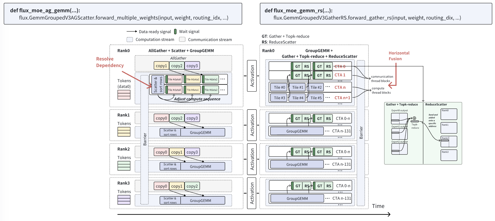

## Design

### Design of MoE kernels

Let's first review the execution process of a MoE layer and understand the implementation using plain torch. Then we can explain how to optimize the process using the Flux kernels.

