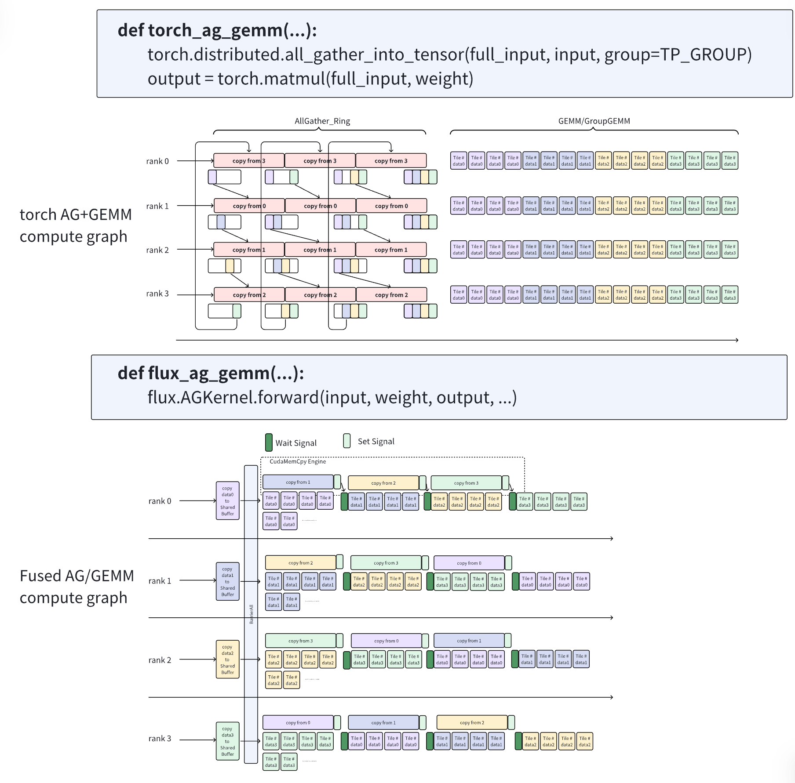

## Design

---
### Design of dense MLP kernels

Let's start with the simple Dense case to understand the basic principle of Flux: Flux fuses the communication I/O into the original cutlass GEMM. While maintaining the original computation efficiency, it achieves fine-grained overlapping of computation and communication. 

#### MLP layer0: AllGather + GEMM
Torch first performs a AllGather operation and then performs a GEMM operation.
Flux launches a GEMM kernel and simultaneously perform data copying using the cudaMemcpy Engine on another stream. The threadblock of GEMM will start computing only after waiting for the dependent data copying to complete, as shown in Figure 1. 

<figure style="text-align: center;">
  
  <figcaption style="text-align:center; font-style:italic">Figure 1. Implementation of MLP layer0</figcaption>
</figure>

#### MLP layer1: GEMM + ReduceScatter

For GEMM + ReduceScatter on Ampere, Flux directly fuses reduce-scatter into the Epilogue of GEMM, as shown in Figure 2. After a threadblock finishes calculating a tile, it directly writes the result to the corresponding rank of the data in the Epilogue. 

<figure style="text-align: center;">
  
  <figcaption style="text-align:center; font-style:italic">Figure 2. Implementation of MLP layer1</figcaption>
</figure>

---
### Design of MoE kernels

#### A quick review of MoE MLP execution
Let's first review the execution process of a MoE layer and understand the implementation using plain torch. Then we can explain how to optimize the process using the Flux kernels. The execution process of a MoE layer is as follows, composed of four parts:

**Token routing** (This is beyond the scope of Flux's design):
1. Gate: compute the gate score for each token and decide the experts for each token.

**MoE layer0**:
1. All-gather: all tokens from all ranks are gathered to a single tensor.
2. Scatter: scatter the tokens for later GEMM computation.
3. GEMM: the input tensor is multiplied by the weight tensor.

**Activation** (This is beyond the scope of Flux's design):
1. Activation: apply the activation function to the intermediate tensor.

**MoE layer1**:
1. GEMM: the input tensor is multiplied by the weight tensor.
2. Gather: gather the tokens from the experts.
3. TopK-reduce: reduce the topk-rows of a token to a single row.
4. Reduce-scatter: scatter the reduced token to all ranks.

#### The implementation of MoE

**Using Torch:** The implementation of an MoE layer using plain torch is as shown in Figure 3. All operations are finished in a sequential order. There is no overlap between the computation and communication.

<figure style="text-align: center;">
  
  <figcaption style="text-align:center; font-style:italic">Figure 3. Implementation of an MoE layer using Torch</figcaption>
</figure>

**Using Flux:** The usage of flux is much simpler: each MoE sub-layer is as simple as just calling a single kernel. The computation-communication overlapping is achieved from two aspects as shown in Figure 4:
1. Decouple && reschedule the computation of tiles along the independent dimension to start the overlapping of computation and communication as early as possible: MoE layer0 reschedules the calculations along Dim-M, and MoE layer1 reschedules the calculations along Dim-N. 
2. Use horizontal fusion in kernels to isolate the impact of fine-grained I/O on computation (for MoE Layer1).

<figure style="text-align: center;">
  
  <figcaption style="text-align:center; font-style:italic">Figure 4. Implementation of an MoE layer using Flux</figcaption>
</figure>

**Fine-grained Remote I/O on Hopper**: On the Ampere architecture, when performing a kernel, usually more thread blocks than the number of SMs are launched for computation. For example, a kernel launches 500 thread blocks. Then nn average, each SM has 4 - 5 thread blocks for the thread block scheduler to schedule and switch. When remote I/O is fused into Gemm Epilogue, when a certain thread block is performing long-latency Remote I/O, the scheduler will switch to other thread blocks for computation (as shown in the upper part of Figure 5). Therefore, fusing remote I/O into the epilogue on A100 is effective.

However, on the Hopper architecture, Nvidia provides Cluster + asynchronous I/O instructions (TMA). In order to make full use of the hardware features and give full play to the performance advantages of asynchronous I/O, Persist Warp Specialization is adopted on H100. Each SM has only one warp-specialized thread block, which will keep computing until all data tiles are computed.

The producer and consumer warps within the thread block form an efficient **asynchronous** pipeline using TMA. The producer warp only launches TMA instructions, while the consumer warp launches MMA instructions. If the communication is fused into the Epilogue of the computation, it will insert a long-latency bubble into the originally efficient asynchronous pipeline, resulting in a reduction in computing efficiency. 